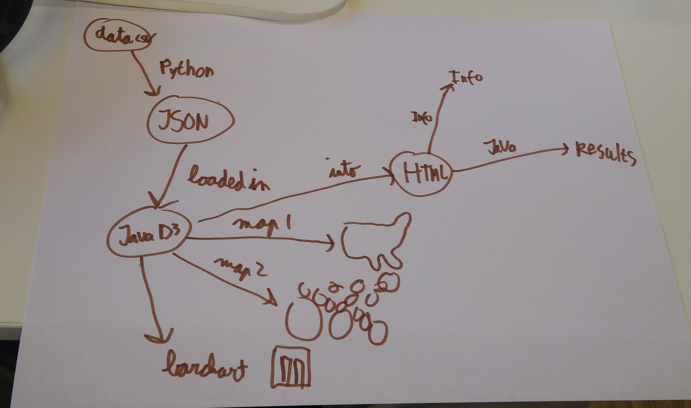

# Project Amerikaanse verkiezingen (D3)

## Design

Het eerste element is een kaart van Amerika gekleurd op basis van de uitslag, rood voor de republikeinse staten en blauw voor de democraten. De gebruiker kan door een knop wisselen met een kaart van Amerika waar de staten een andere grootte hebben op basis van het aantal kiesmannen. Deze zal ook op dezelfde manier gekleurd zijn. Beide kaarten worden gecreëerd met de datampas library. Door op een staat te klikken van 1 van de kaarten is er een barchart met de uitslagen van die staat voor de kandidaten. Door weer op de barchart te klikken, kan men weer de andere kaart verkrijgen. Dit zijn 3 linked views. De interactiviet zal bestaan uit een dropbox menu om een staat te kiezen, mouse over pop-ups en een button om van kaart te wisselen. Hiervoor is een dataset nodig over elke staat en hun uitslag in JSON vorm, dit zal ik nog moeten converteren.

Als er tijd over is dan zou ik nog kunnen kijken naar dempografische aspecten, opleiding van de kiezers of opkomst cijfers van de verkiezingen.

schets: 

APIs:
* D3:
  * datamaps
  * d3 tool tip
* JSON for data file
* Python for converting data to JSON
* Java for script
* HTML for web page

Bronnen:
* https://datamaps.github.io/
* http://www.presidency.ucsb.edu/showelection.php?year=2016
*  "Table 233. Educational Attainment by State". United States Census Bureau. 2011. Archived from the original on February 21, 2012. Retrieved 2014-05-23.
