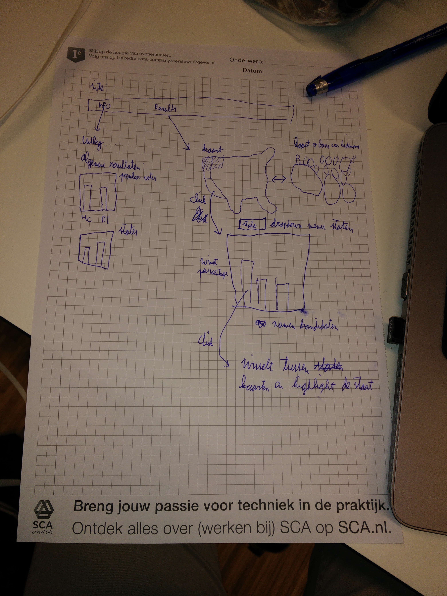

# Project Amerikaanse verkiezingen (D3)

## Day 1 9-1-2017

* Proposal is gemaakt. Het idee is om de gebruiker in te lichten over het amerikaanse kiesstelsel en de resultaten van de
verkiezingen in 2016

* Schets: 

## Day 2 10-1-2017

* Design proposal gemaakt. Het idee is een kaart van Amerika gekleurd op basis van de uitslagen van de verkiezingen,
 een tweede kaart waar de staten een grootte hebben op basis van het aantal kiesmannen en een barchart met de uitslag in die staat.

* Start website, basic html file met een background kleur beige. Gekleurde kaart van amerika met de interactie van pop-ups en hover. De staat waar je over hovert kleurt oranje en er verschijnt een pop-up van de naam van de staat

## Day 3 11-1-2017
* Navigation bar met twee andere html files. Met de bar is het mogelijk om te switchen tussen de html files. 1 van de html files is voor de informatie van het kiesstelsel, de ander met data en de visualisaties en de laatste is voor een educatief filmpje.

* Klikken met muis op een staat creëert een barchart met de uitslag van de votes naar de kandidaten in die staat. Ook is er een dropdown menu waar je een staat mee kan kiezen die dezelfde barchart genereert.

* De kaart heeft labels gekregen met daarin het aantal kiesmannen. Het is dus nu duidelijk te zien welke staat hoeveel kiesmannen heeft.

## Day 4 12-1-2017
* De pagina is mooier gemaakt door de navigatie bar een Amerikaanse vlag te geven aan de linkerkant. Het verschuiven van elementen en vergroten/verkleinen van elementen zodat ze goed samen op de pagina passen.

* Na veel werk is het duidelijk dat de tweede kaart niet mogelijk is. Ik wou het doen met bubbels en de eerste kaart laten verdwijnen maar dit wordt als 1 visualisatie gezien. Het idee is nu om een scatter plot te maken met de bubbels van de staten met hun grootte als straal van de cirkels

## Day 5 13-1-2017

* Presentatie houden voor de groep. Hieruit kwam dat het misschien interessant is om iets anders te linken aan de verkiezingen zoals opleidingverdeling van een staat

* Ik heb gegevens over percentages opleiding per staat. De derde visualisatie wordt dan een pie chart met een slider
waarin je high-school, bachelor of advanced grads.

## Day 7 15-1-2017

* Interactie pie chart gelukt met kaart. Geen slider meer voor de pie chart, de opleidingen vormen namelijk gewoon 100% en dus is een slider onnodig.

* Knop voor kaart zodat er bubbels verschijnen/verdwijnen ter grootte van aantal kiesmannen. Dit geeft nog een ander beeld aan de kaart. Het geeft duidelijker aan wat grote en belangrijke staten zijn.

## Day 8 16-1-2017

* Pie chart is een donut chart geworden met de legenda erin. Verder heeft de pie chart een pop up functie van de percentages

* Interactie bubbels: pop-up van de bubbels en klikken bubbles. Met het klikken van de bubbels kan hetzelfde worden bereikt door op een staat te klikken

## Day 9 17-1-2017
* Pagina indeling veranderd van 3 html naar 1 file. De navigation bar werkt nu door naar div's te gaan met verschillende ID's. Hier heb ik ook een jQuery functie gemaakt die mooi scrolt naar een div.

* Pagina start gemaakt met vlag als achtergrond. Hier begint de pagina en kan men klikken om te beginnen

* Pagina informatie begin gemaakt met indeling van plaatjes en tekst, deel van de tekst en figuren.

## Day 10 18-1-2017
* Indelen informatie kopjes in de informatie sectie. Dit ging echter niet helemaal succesvol, totdat rond 3 uur de tip bootstrap voorbij kwam

* Gebruik van bootstrap begrijpen en proberen toe te passen, nog niet heel veel mee gedaan

## Day 11 19-1-2017
* Prototype af! Indeling pagina gelukt, mooi alles naast elkaar, met mooie foto's. Dit is gelukt met bootstrap

* Bugs eruit halen: blauw worden bronnen optie. Nog mooier met transitions maken

## Day 12 23-1-2017
* Mooie transitions van de donut char en bar chart gemaakt als je klikt of iets verandert.

* Klik op een staat verandert de kleur van de geklikte staat in paars. Dit heeft alleen een rare bug dat als je klikt en in de staat blijft dat de staat niet paars gekleurd blijft. Dit ligt aan Datamaps zelf (block org heeft ook een voorbeeld van die bug zie: http://bl.ocks.org/dmachat/b75a5a01cfb31cf92cf5)

* Scatterplot staat er met goede stralen en kleuren. Hier moeten nog klik functies en hover functies komen. Er is hier ook wel een duidelijk verband zichtbaar tussen stemgedrag en opleidingsniveau.

## Day 13 24-1-2017
* Scatter plot is gelinkt aan de andere visualisaties. Ook zal de scatterplot de opacity aanpassen op basis van de staat die je bekijkt. Het heeft een hover functie en tip.

* De staat in de kaart wordt gekleurd als je die bekijkt dmv de dropdown, klikken op de kaart of scatterplot. De staat wordt dan geel gekleurd.

* Ik heb de slider vervangen en de bubbels weggehaald. In de plaats daarvan heb ik een reset button gemaakt die alle data weer op de eerste toestand zet.

## Day 14 25-1-2017
* CSS en JS files goed gesorteerd en in mooie verschillende files gezet. Niet meer dat alles in 1 file zit. Verder alles voorzien van commentaar

* Bug van dropdown menu gefixt. De dropdown menu gaat nu ook mee met de update en wordt dus op de goede staat gezet wanneer alles wordt geupdate aan een staat.

## Day 15 26-1-2017
* API's lokaal maken zodat github mijn pagina ook kan runnen

* Informatie layout heel anders. Ronde plaatjes, twee delen opsplitsen, waarvan het eerste deel info is en het tweede deel algemene verkiezingsuitslagen.

* Parallax achtergond plaatjes
