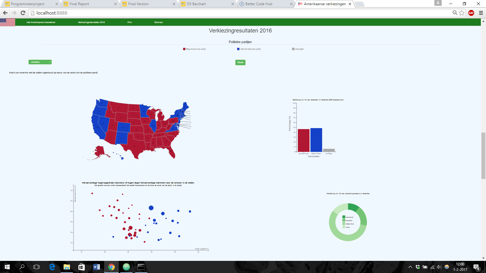
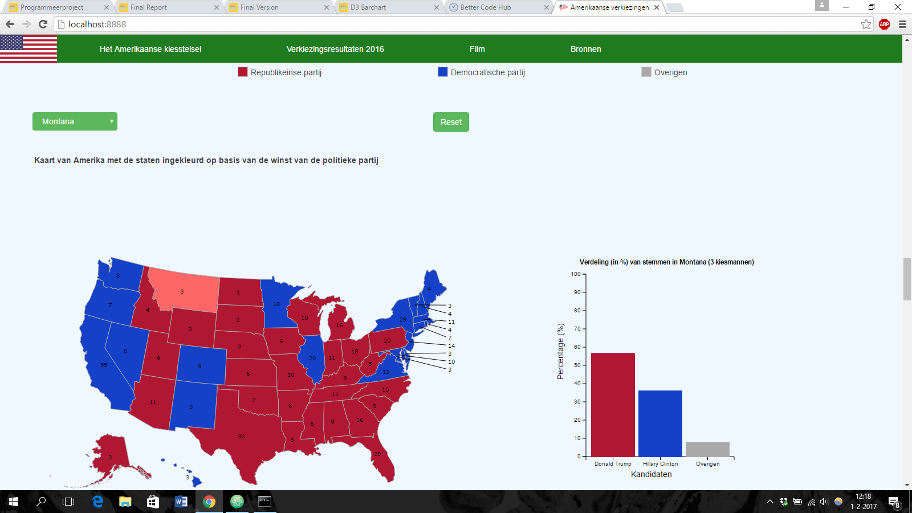
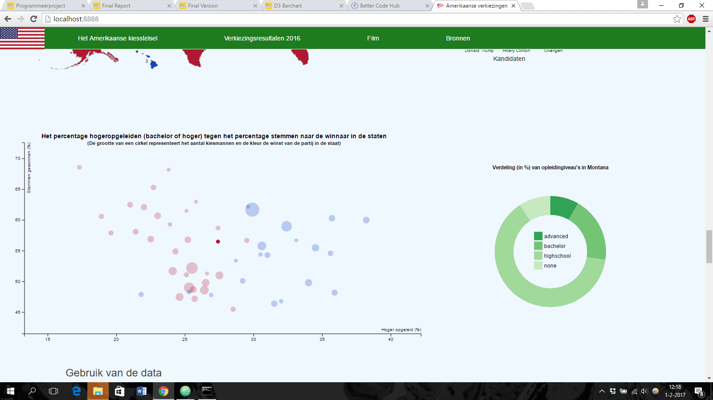

# Project Amerikaanse verkiezingen (D3)

## Jan Huiskes 107409292

De pagina geeft een gedetailleerde weergave van de verkiezingen van 2016 en legt een brug tussen stemgedrag en opleidingsniveau. De gebruiker kan zo zien wat per staat de uitslag is geweest, hoe de verdeling van opleidingsniveau's specifiek in een staat is en of er een verband tussen opleidingsniveau en stemgedrag is. De gebruiker kan daarnaast ook alles leren over het kiesstelsel van Amerika met alle benodigde informatie die boven de datavisualisaties staat. De data is eerst ingesteld op Amerika in het geheel. De barchart geeft de resultaten weer van de stemmingen in een staat of heel Amerika. De donutchart geeft de verdeling van opleidingsniveau's weer in een staat of heel Amerika. De scatterplot geeft de staten weer met op de x-as het percentage hoger opgeleiden (bachelor of hoger) en op de y-as het percentage stemmen waarmee de kandidaat de staat heeft gewonnen. De kleur representeert de winnaar en de grootte het aantal kiesmannen. Door te klikken op een punt in de scatterplot, een staat op de kaart of een staat uit het dropdown menu kan men alles aanpassen op die staat. De staat wordt op de kaart lichter gekleurd, de bar- en donutchart worden aangepast op de gegevens van die staat en in de scatterplot vervagen de stippen behalve de stip voor die staat.

Screenshots:

Alle files die ik heb gebruikt maar niet zelf heb gemaakt zitten in de d3 map of online in de html gezet:
* D3:
  * datamaps
  * d3 tool tip
  * d3 topojson
* Bootstrap
* jQuery

Alle foto's voor de webpagina staan in de map images en alle foto's voor de reports, design en readme documenten staan in de map doc
