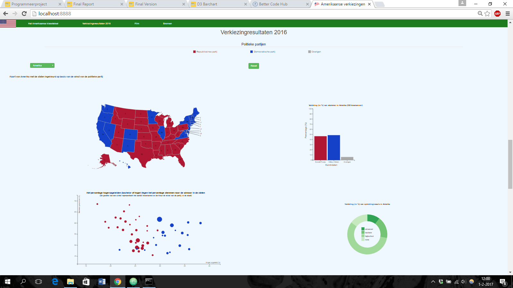

# Report Amerikaanse verkiezingen (D3)

## Algemeen

Op 8 november 2016 werd er in Amerika gestemd voor een nieuwe president. De strijd ging
dit keer tussen Hilary Clinton van de Democratische partij en Donald Trump van de Republikeinse partij. 

Screenshot: 

De pagina geeft een gedetailleerde weergave van de verkiezingen van 2016 en legt een brug tussen stemgedrag en opleidingsniveau. De gebruiker kan zo zien wat per staat de uitslag is geweest, hoe de verdeling van opleidingsniveau's specifiek in een staat is en of er een verband tussen opleidingsniveau en stemgedrag is.  De gebruiker kan daarnaast ook alles leren over het kiesstelsel van Amerika met alle benodigde informatie die boven de datavisualisaties staat. De data is eerst ingesteld op Amerika in het geheel. De barchart geeft de resultaten weer van de stemmingen in een staat of heel Amerika. De donutchart geeft de verdeling van opleidingsniveau's weer in een staat of heel Amerika. De scatterplot geeft de staten weer met op de x-as het percentage hoger opgeleiden (bachelor of hoger) en op de y-as het percentage stemmen waarmee de kandidaat de staat heeft gewonnen. De kleur representeert de winnaar en de grootte het aantal kiesmannen. Door te klikken op een punt in de scatterplot, een staat op de kaart of een staat uit het dropdown menu kan men alles aanpassen op die staat. De staat wordt op de kaart lichter gekleurd, de bar- en donutchart worden aangepast op de gegevens van die staat en in de scatterplot vervagen de stippen behalve de stip voor die staat.

## Technische design

Alle visualisaties zijn gemaakt met d3 en staan in de folder met de naam js

### map.js en index.html
Het eerste element is een kaart van Amerika gekleurd op basis van de uitslag, rood voor de Republikeinse staten en blauw voor de Democratische staten. Deze is gemaakt met behulp van datamaps, ingebouwd met een hover functie die de grens verandert naar zwart en de naam van de staat weergeeft. Naast de kaart is er een dropdown menu en een reset button. De reset button zorgt ervoor dat alle veranderingen door klikken weer teruggezet worden naar de begininstellingen. Het dropdown menu kan men gebruiken om een staat te selecteren.

### bar.js
Het tweede element is een barchart. Deze barchart geeft eerst de verdeling van stemmen in heel Amerika weer naar de kandidaten. Ook deze heeft een hover functie ingebouwd die de grens van de bar zwart maakt en het exacte percentage weergeeft.

### donut.js
Het derde element is een donutchart. Deze donutchart geeft eerst de verdeling van opleidingsniveau's in heel Amerika weer. Ook deze heeft een hover functie ingebouwd die de grens van de slices van de donutchart zwart maakt en het exacte percentage weergeeft van een niveau. Er zijn vier niveaus (van hoog tot laag): advanced, bachelor, highschool en none (geen).

### scatter.js
Het laatste element is een scatterplot met op de x-as het percentage hoger opgeleiden (bachelor of hoger) en op de y-as het percentage stemmen waarmee de kandidaat de staat heeft gewonnen. De kleur representeert de winnaar en de grootte het aantal kiesmannen. Ook hier is weer een hoverfunctie ingebouwd die de naam van een staat geeft, het aantal kiesmannen en de coordinaten van de stip.

### update.js
Al deze elementen zijn gelinkt aan elkaar: Door op de kaart, op de scatterplot of uit het dropdown-menu een staat te kiezen door erop te klikken wordt de staat op de kaart lichter gekleurd, de bar- en donutchart aangepast met een transition op de gegevens van die staat en in de scatterplot vervagen de stippen behalve de stip voor die staat. Zo is het mogelijk om specifiek de uitslag en opleidingsniveau's te zien in een staat. Door de reset button wordt alles weer teruggezet naar het begin. Update maakt gebruik van de input id. Deze id bepaalt welke staat gekozen is. Als de id 'US' is dan zal alles weer terug worden gezet naar het begin (hier maakt de reset button gebruik van). De kleur van de kaart wordt aangepast met updateChoropleth(). De bar- en donutchart veranderen met een mooie transition() functie. De opacity van alle dots in de scatterplot worden 0.25 behalve de gekozen staat. Verder zet de update functie ook de dropdown menu op de juiste staat om bugs te voorkomen met de onchange() functie waar de dropdown menu gebruik van maakt. Zo is alles gelinkt met elkaar.

### BUG (kan ik niks aan doen)
De kaart heeft een bug waar ik niks aan kan doen en dat heeft met de datamaps code te maken: http://bl.ocks.org/dmachat/b75a5a01cfb31cf92cf5. Door een staat te kiezen op de kaart en de muis snel weg te halen, wordt de staat goed lichter gekleurd. Echter, wanneer de muis een tijdje op de staat blijft rusten na het klikken en vervolgens de muis weg te halen, blijft de staat niet licht gekleurd.

### Overige bestanden
* info.js maakt de barcharts in de informatie sectie met de globale uitslag. Deze doet het op dezelfde manier als bar.js. Dit tel ik niet als visualisatie, maar is wel belangrijk voor het informatie gedeelte.

* scroll.js is een functie die fancy scrolling met de navbar mogelijk maakt.

## Veranderingen tegenover het eerste design

In het eerste design wilde ik een tweede kaart maken met bubbels ter grootte van het aantal kiesmannen in een staat. Door op een knop te drukken kon je switchen tussen de 2 kaarten. Het was echter heel lastig om zo'n kaart te maken zonder datamaps en als het met databubbels mogelijk was die over de kaart kwamen, werd dit maar als 1 visualisatie gezien dus er was iets nieuws nodig.

Door extra data van het internet te halen over opleidingsniveau's in de staten was een link tussen stemgedrag en opleidingsniveau mogelijk met een donutchart. Het idee was eerst een donutchart met slider voor de verschillende diploma's maar dit was onnodig en alles kon gewoon in 1 donutchart. Er zou nog wel een knop komen om bubbels te laten verschijnen op de kaart ter grootte van het aantal kiesmannen.

De bubbels bleken echter heel onduidelijk door overlappingen op de kaart en onnodig. Het idee was om dit om te zetten naar een scatterplot met daarin onder andere het percentage hoger opgeleiden (bachelor of hoger). Dit gaf ook beter de link tussen opleidingsniveau's en stemgedrag weer. De scatterplot moest ook gelinkt zijn en dus kreeg het ook klikfuncties om het met de rest te linken. Uiteindelijk kwam er ook een reset button die alles weer terugzette op de eerste data van heel Amerika.

## Verantwoording veranderingen

De eerste verandering van een tweede kaart naar donutchart was vanwege het feit dat een tweede kaart zelf maken heel lastig was en een kaart van bubbels over de andere kaart alsnog maar als 1 visualisatie werd gezien. De trade-off hier is dat er meer data wordt gelinkt met de verkiezingen maar een duidelijker beeld van de belangrijke staten wegvalt. Het is echter nog wel interessant om te kijken of een tweede kaart mogelijk was als er meer tijd was. Alhoewel de tweede kaart wegviel, kwam er wel een scatterplot in de plaats waar de punten een grootte hadden op basis van het aantal kiesmannen. Hier werd dus ook duidelijk welke staten belangrijk waren. Het was ook duidelijk welke staten de swing states (staten die belangrijk zijn om te winnen tijdens de verkiezingen) waren, namelijk onder aan de y-as en er kon een mooi verband gelegd worden tussen opleidingsniveau en stemgedrag.
